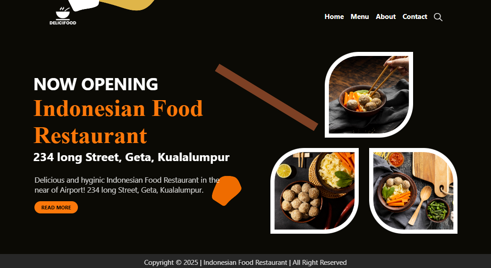

# 🍛 Indonesian Food Restaurant



A clean and minimal restaurant landing page built from a **PSD design**.  
This is my **first PSD-to-HTML conversion project**, focusing on layout, structure, and basic animations using HTML, CSS, and JavaScript.

---

## 🔗 Live Demo
👉 [View Website](https://indonesian-food-restaurant-nr.netlify.app/)

---

## 🧾 Project Overview

This project represents the **homepage** of an Indonesian restaurant.  
It includes a hero section, navigation bar, responsive layout, and scroll-based animations.

⚠️ **Important Note:**  
Only the **Home Page (index.html)** is functional in this version.  
Links such as **Menu**, **About**, and **Contact** are **placeholders** and not implemented yet.

---

## 🧠 Key Learnings

- Converting a PSD file to a responsive HTML structure.
- Using **Flexbox** and **media queries** for responsiveness.
- Applying basic animations with CSS and JavaScript.
- Implementing a **mobile sidebar menu** toggle with JS.
- Dynamically updating the footer year using JavaScript.

---

## 🛠️ Technologies Used

- **HTML5**
- **CSS3 (Flexbox, Media Queries, Animations)**
- **Vanilla JavaScript**
- **Google Fonts**

---

## 📂 Folder Structure

```
Indonesian-Food-Restaurant_First-PSD-Project/
│
├── index.html
├── /src
│ ├── style.css
│ └── script.js
├── /images
│ ├── logo.png
│ ├── bg.jpg
│ ├── search-icon.png
│ ├── foodBanner1.png
│ ├── foodBanner2.png
│ └── foodBanner3.png
└── indo-res-banner.png
```


---

## 💫 Features

- Responsive design with flexible layout.
- Scroll-based animations using Intersection Observer.
- Mobile-friendly hamburger menu with sidebar.
- Automatic copyright year.

---

## 🚀 Future Improvements

- Build and link functional pages for:
  - About
  - Menu
  - Contact  
- Add smooth scrolling and hover effects.
- Improve responsiveness for smaller devices.

---

## 👨‍💻 Author

**Nur Nabi Khan**  
🌐 [GitHub Profile](https://github.com/nurnabi7002)  
📧 *Open to feedback and suggestions!*

---
